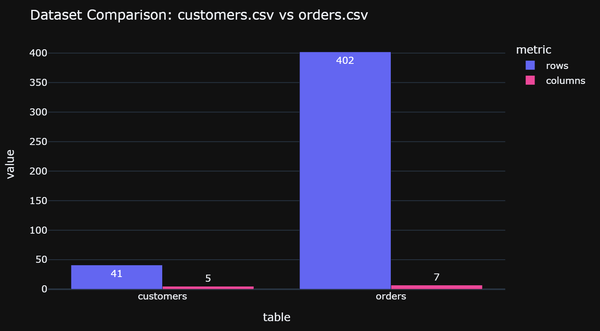
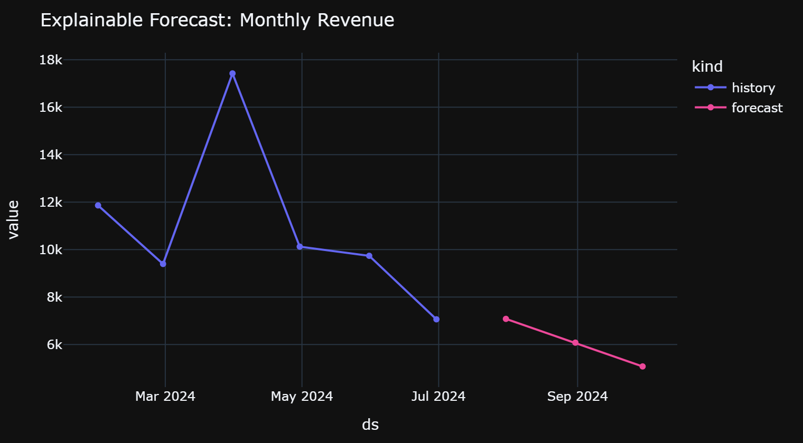
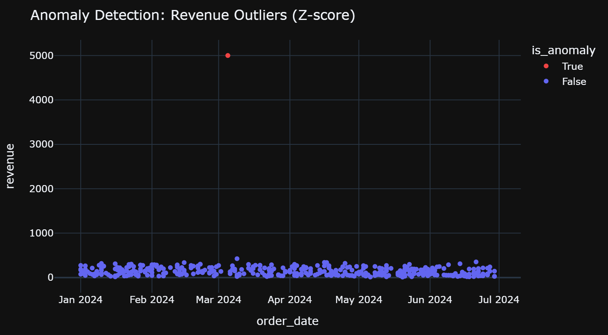
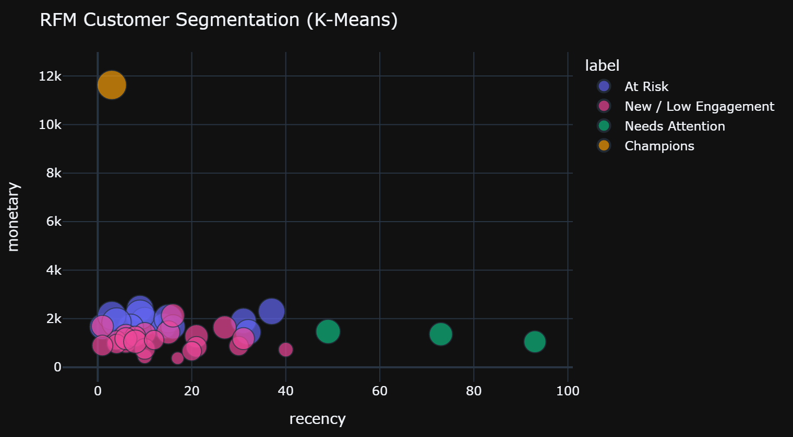
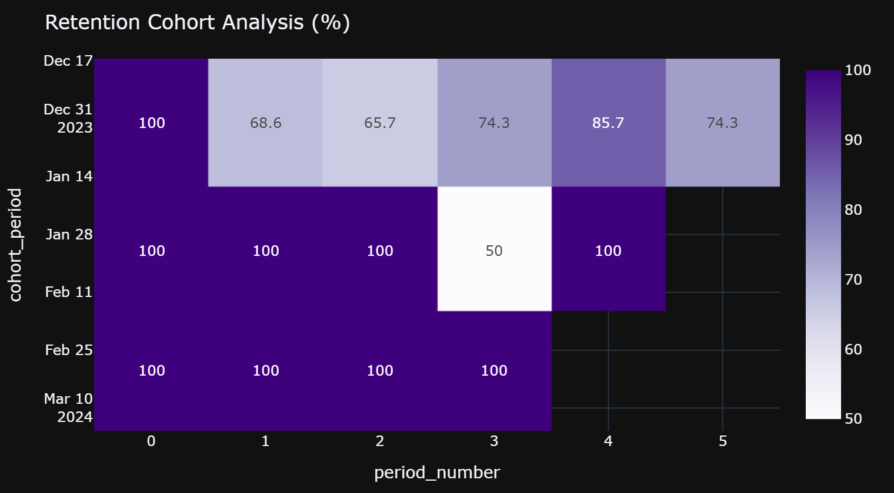
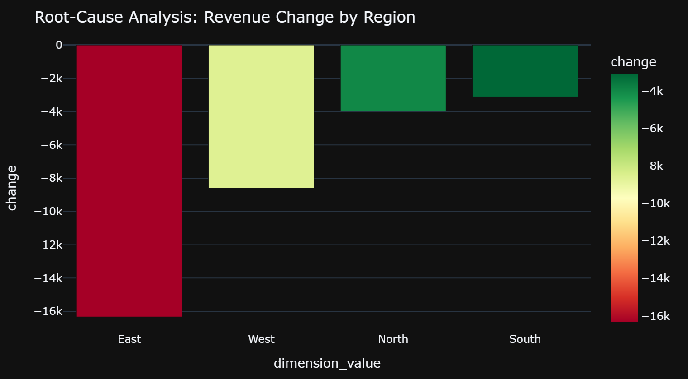
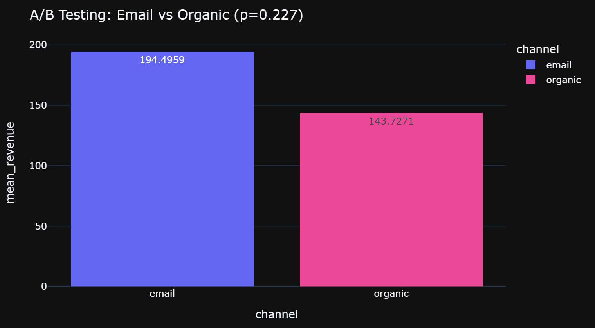

# AI Data Analyst

Upload a CSV/Excel dataset and ask questions about it in plain English. The
LLM never does arithmetic — it only classifies intent and plans an operation;
every number shown comes from real Pandas/SQL/scikit-learn execution.

A dark-themed dashboard with a top navbar spanning 15 sections: multi-file
joins, natural-language Q&A with conversational memory, automated EDA,
forecasting, anomaly detection, RFM segmentation, cohort retention, A/B
testing, root-cause decomposition, what-if simulation, a pin-to-dashboard
view, one-click HTML export, and full LLM cost/audit transparency.

## Screenshots

All generated from `sample_data/` via `docs/generate_assets.py` — real
computed output, not mockups.

| | |
|---|---|
|  |  |
|  |  |
|  |  |
|  | |

## How this compares

| | Traditional BI tool (Tableau/PowerBI) | Raw ChatGPT / LLM chat | **AI Data Analyst** |
|---|---|---|---|
| Numbers come from | Real query engine | The model's own arithmetic (can hallucinate) | Real query engine (Pandas/SQL/scikit-learn) |
| Natural-language Q&A | No (drag-and-drop UI) | Yes | Yes — but grounded, never freehand |
| Shows the exact code/query run | Sometimes (advanced mode) | No | Always, per answer (trust trace) |
| Self-corrects a failed query | No | No (just re-answers, possibly still wrong) | Yes, bounded retry with validated re-plans |
| Trust/confidence indicator per answer | No | No | Yes (0-100 trust score) |
| Statistical tests (t-test, chi-square) | Plugin/extension needed | Manual prompting, unverified math | Built in, real scipy |
| Forecasting with confidence intervals | Plugin/extension needed | Unreliable at exact numbers | Built in, real statsmodels |
| Works with no LLM configured | N/A | No | Yes — degrades to deterministic fallbacks |
| Cost/token transparency | N/A | Rarely shown | Built-in LLM Usage dashboard |
| Self-hostable free | No (or limited) | No | Yes (Streamlit + local Ollama option) |

## Architecture

```
question -> intent_parser (LLM) -> operation_planner (LLM, validated JSON)
         -> executor (deterministic Pandas/DuckDB, NO LLM)
         -> response_composer (LLM, given only the computed result)
```

See `core/` for each stage and `core/validation.py` for the guardrails
(schema-checked columns, allow-listed agg functions, SQL injection guards).

## Status

Implemented (Sections 2 & 4 of the spec):
- Core LLM-as-planner / code-as-executor pipeline (`core/`)
- Automated data profiling & cleaning with user approval (`analysis/profiling.py`)
- Natural-language Q&A over Pandas + DuckDB SQL, with a full audit log/trust trace
- Automated EDA report (`analysis/eda.py`)
- Explainable forecasting via Holt-Winters (`analysis/forecasting.py`)
- Anomaly detection: z-score, IQR, Isolation Forest (`analysis/anomaly_detection.py`)
- RFM + K-Means segmentation with business labels (`analysis/segmentation.py`)
- Graceful degradation when the LLM is unavailable (templated fallbacks everywhere)
- Conversational memory (`core/memory.py`): the last 5 turns (question, intent,
  op_type, composed answer — never raw data) are passed as text context into
  the intent parser and operation planner, so "now break that down by region"
  resolves against the prior question. Wired into both the Streamlit UI
  (per-session, with a "Clear conversation memory" button) and the FastAPI
  layer (per `dataset_id` + `session_id`).
- Multi-file / multi-table joins (`core/join_planner.py`): upload several
  related files, and candidate join keys are found deterministically by real
  value overlap between columns (never by name alone). The LLM only picks
  among those pre-verified candidates to decide which joins to run and in
  what order; `validate_join_plan` rejects any proposed join whose key pair
  wasn't actually a verified candidate, even if both columns individually
  exist. The merge itself runs in Pandas, with the exact merge calls shown
  in a trust-trace expander, same as the Q&A audit log.
- Auto-chart-type selection (`core/chart_selector.py`): deterministic, based
  on the computed result's shape (dtypes, cardinality, row count) — bar for a
  low-cardinality category + numeric, line for a date + numeric, heatmap for
  two category dimensions + numeric, scatter for two numeric columns,
  histogram for a single numeric column across many rows, table otherwise.
  Wired into the Ask-a-Question tab, replacing the old fixed bar-chart-always
  behavior; the caption under each chart names which rule fired.
- Data quality scoring (`analysis/profiling.py`): a single composite score
  (0-100) from completeness (missingness), consistency (duplicate rate), and
  validity (IQR outlier rate), shown as metrics on the Profiling tab, plus a
  within-session history line chart.
- Dataset versioning (within-session): every upload, join, and cleaning
  action snapshots the working DataFrame into `st.session_state.dataset_versions`,
  with a "Version history" table and one-click rollback on the Profiling tab.
  This fixed a real bug along the way: the sidebar uploader used to re-parse
  and overwrite `session_state.df` on *every* rerun (i.e. any button click
  anywhere in the app), silently discarding any cleaning or join already
  applied — it's now guarded by an upload signature so it only resets on an
  actual new upload. The cleaning form also gained per-column imputation
  (mean/median/mode/drop-rows), which existed in `apply_cleaning` but was
  never exposed in the UI.
- A/B testing / statistical significance (`analysis/significance_testing.py`):
  Welch's t-test for comparing two groups or two time periods on a metric
  (with Cohen's d effect size), and a chi-square test for association between
  two categorical columns — both pure scipy, with the significance verdict
  (p < 0.05) stated in plain language derived directly from the p-value.
  Exposed as an "A/B Testing" tab in the app.
- Cohort analysis (`analysis/cohort_analysis.py`): groups customers by the
  period of their first activity (monthly/weekly/daily), then computes the
  real retention count and percentage for each cohort across subsequent
  periods — pure Pandas, shown as a heatmap on the "Cohort Analysis" tab.
- Root-cause / driver analysis (`analysis/root_cause_analysis.py`): given a
  metric, a date column, and a dimension, sums the metric per dimension value
  in each of two periods and attributes each value's share of the total
  change ("Region East dropped from 200 to 100, accounting for 105% of the
  decline") — pure Pandas, shown as a bar chart on the "Root-Cause Analysis"
  tab.
- What-if / scenario simulation (`analysis/whatif_simulation.py`): fits a real
  linear regression between an input and a target column, then projects the
  target under a user-chosen % change to the input — always labeled
  "SIMULATION, not measured data" with the model's R² shown so a weak fit is
  visible, never silently trusted.
- Drag-and-pin dashboard: any Q&A result can be pinned as a persistent tile
  (chart + answer) on the new "Dashboard" tab, and removed individually or
  cleared. (True drag-to-reposition isn't implemented — tiles are pinned in
  the order added — but the "save any result as a persistent tile" behavior
  from the spec is.)
- One-click exportable report (`reports/export.py`, wired into the "Export
  Report" tab): bundles the EDA narrative, the data profile, and the
  session's full Q&A history into a single self-contained HTML file, download
  button included. PDF export was descoped in favor of HTML to avoid a heavy
  rendering dependency (see the "Not yet implemented" note below).
- Self-correcting execution loop (`core/self_correcting.py`, Section 9): if a
  plan errors out or returns an empty result, the failure is fed back to the
  operation planner as `error_context` and retried, bounded to 2 retries —
  never an unbounded loop, never a silent failure. Every attempt still goes
  through the same validated-plan -> deterministic-executor path; only the
  prompt changes between attempts. Wired into both the Streamlit Q&A tab
  (shows "self-corrected after N attempts" plus a per-attempt log in the
  trust trace) and the FastAPI `/ask` endpoint (`attempts` in the response).
- LLM cost & token-usage dashboard (`core/llm_client.py` + "LLM Usage" tab):
  every LLM call, success or failure, is logged with backend, latency, and a
  token estimate on the `LLMClient` instance itself (persisted in
  `session_state` so the log survives reruns) — cumulative tokens, average
  latency, and failure count are shown so the AI part of the app isn't a
  hidden cost.
- Explainable trust score per answer (`core/trust_score.py`, Section 9): a
  0-100 score + label (Failed/Low/Medium/High/High self-corrected) shown
  under every Q&A answer, derived only from facts validation/execution
  already established — execution error, whether the plan was a bare
  fallback (LLM's plan was rejected or unavailable), and whether it took a
  retry — never the LLM's own opinion of its answer. This turns the existing
  operation-plan/code trust-trace expander into a glanceable verdict.
- Dark SaaS-style UI with a top navbar (`app.py`): a violet/cyan neon theme
  (`.streamlit/config.toml` + supplementary CSS) replaces the default
  Streamlit look, `plotly_dark` is the global chart template, and navigation
  moved from the sidebar into a horizontal pill-tab navbar at the top of the
  page — the sidebar now holds only file upload and LLM backend status.
- Robust CSV ingestion (`core/file_loader.py`): tries 5 encodings
  (`utf-8-sig`, `utf-8`, `cp1252`, `latin-1`, `utf-16`) with delimiter
  auto-detection in each, so semicolon-separated European exports, BOM'd
  files, tab/pipe-delimited files, and Latin-1/Windows-1252 legacy exports
  all load correctly instead of erroring or silently misparsing.
- Multi-type join controls (`core/join_planner.py`): beyond the AI-planned
  join, a manual mode lets you pick left/right table, left/right key, and
  join type (inner/left/right/outer) directly; a "dimension compatibility"
  heatmap shows every column-pair's real value-overlap ratio between two
  tables, not just the ones strong enough to auto-suggest.
- Auto-comparison Dashboard: uploading 2+ files immediately shows a
  multi-chart comparison (grouped bar, donut, heatmap, radar, scatter — 5
  distinct chart types, one shared 7-color palette) across all uploaded
  tables, plus a "Version History" view charting every join/clean/rollback
  snapshot taken during the session — not just the current state.
- FastAPI layer exposing the same pipeline (`api/main.py`)
- pytest suite (119 tests) covering validation, executor, analysis modules,
  join planning, the CSV loader, and the LLM-facing stages via a mocked
  `LLMClient` (`tests/`) — proves both that a bad/hallucinated LLM plan (or
  join proposal) gets rejected by validation before it can touch real data,
  and that every stage degrades to a deterministic fallback when the LLM is
  unreachable. `core/executor.py`, `core/validation.py`,
  `core/self_correcting.py`, `core/trust_score.py`, `core/join_planner.py`,
  and `core/file_loader.py` are all at 90%+ coverage; `core/llm_client.py`
  sits lower (the actual network calls to Groq/Ollama are intentionally left
  untested — everything around them, including usage-logging, is covered).
  All 119 tests also pass with `FutureWarning` promoted to a hard error (no
  deprecation warnings anywhere in the dependency chain).
- **Deeply verified against a real Groq key and real sample data**, not just
  mocks: the full pipeline (join planning → intent parsing → operation
  planning → execution → response composition → self-correction → trust
  scoring → conversational memory) was run end-to-end against
  `sample_data/`, and every deterministic analysis module was checked
  against *known facts baked into that data* — anomaly detection correctly
  flags the deliberately-injected $5,000 outlier order, and root-cause
  analysis correctly attributes the engineered May-June revenue drop to the
  "East" region.

Not yet implemented, and why:
- **Needs external credentials/services this environment doesn't have** —
  live DB/Sheets connectors (stubbed in `connectors/db_connectors.py`, not
  wired into the UI: needs a real Postgres/MySQL instance or a shared Google
  Sheet to test against), scheduled email/Slack digests (SMTP/Slack app
  credentials), auth/multi-tenant (needs an identity provider), true
  cross-session dataset persistence beyond one browser session (needs a real
  DB/object store — the in-session versioning above is what exists today).
- **Needs infrastructure beyond a single Streamlit process** — streaming/
  incremental analytics at scale (DuckDB/Polars chunking for datasets too
  large for memory), full MLOps pipeline (CI/CD, model registry, retraining
  triggers), differential privacy (calibrating noise correctly is its own
  project), semantic caching and schema/column embeddings for joins (need an
  embedding model + vector store — the current join-key inference uses exact
  value-overlap instead, which is precise but not fuzzy across differently-
  worded schemas).
- **Genuinely large second-phase efforts, not a single module** — agentic
  multi-step reasoning (chaining filter -> aggregate -> compare -> segment
  with validation between steps), plugin architecture for user-registered
  analysis functions, natural-language-to-dashboard generation, causal
  impact analysis, AutoML model selection, SHAP/LIME explainability,
  synthetic data generation, active learning from feedback.
- **Descoped for a lighter dependency footprint** — true PDF export (HTML
  export is implemented instead, avoiding a heavy PDF-rendering dependency),
  voice input (needs a browser mic component beyond core Streamlit),
  multi-language support (untested — the LLM prompts aren't language-locked,
  but no explicit handling or testing was done for non-English input/output).

These are all scoped in the original spec and can be added module-by-module
on top of the existing `core/` pipeline without changing it — none of them
require touching the intent_parser -> operation_planner -> executor ->
response_composer contract.

## Local setup

```bash
python -m venv .venv && source .venv/bin/activate   # .venv\Scripts\activate on Windows
pip install -r requirements.txt
cp .env.example .env   # fill in GROQ_API_KEY, or set LLM_BACKEND=ollama for local
streamlit run app.py
```

Run tests:

```bash
pytest --cov=core --cov=analysis tests/
```

Run the API layer:

```bash
uvicorn api.main:app --reload
```

## LLM backends

Set `LLM_BACKEND` in `.env`:
- `groq` (default) — hosted inference via the Groq API, needs `GROQ_API_KEY`.
  Model is configurable via `GROQ_MODEL` (default `openai/gpt-oss-20b`) since
  Groq's hosted model lineup changes over time — check
  `client.models.list()` or the Groq console if the default 404s.
- `ollama` — fully local, run `ollama pull llama3.1:8b` first and point
  `OLLAMA_HOST`/`OLLAMA_MODEL` at your instance

If the configured LLM is unreachable, the app does not crash: intent
defaults to "aggregation", the operation planner falls back to a `describe`
plan, and the response composer returns a templated summary of the real
computed result instead of a generated sentence.

## Sample data

`sample_data/customers.csv` and `sample_data/orders.csv` (regenerate with
`python sample_data/generate_sample_data.py`) are two related, joinable
files seeded with intentional real-world messiness so every feature has
something to find: missing emails/quantities, duplicate rows, a $5,000
outlier order, an engineered revenue decline in the "East" region
(May-June), and enough repeat customers/dates for RFM segmentation and
cohort retention to be meaningful. Upload both together to try the join
planner, or `orders.csv` alone for everything else.

## Deployment

- **Docker**: `docker build -t ai-data-analyst . && docker run -p 8501:8501 --env-file .env ai-data-analyst`
- **Streamlit Community Cloud**: connect the repo, set `GROQ_API_KEY` in Secrets
- **Hugging Face Spaces**: Docker SDK, same Dockerfile
- **Fly.io**: `flyctl launch --dockerfile Dockerfile --internal-port 8501`,
  then `flyctl secrets set GROQ_API_KEY=...` and `flyctl deploy`. Note: Fly
  requires a payment method on file before provisioning any machine, even
  within free-tier usage — add one at `fly.io/dashboard/personal/billing`
  first if you hit a "requested machine count exceeds organization limit"
  error.
